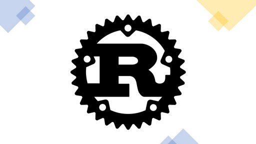
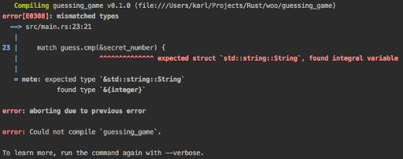
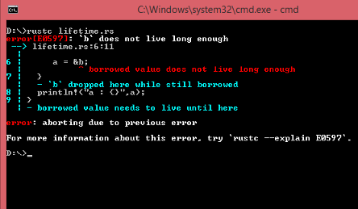
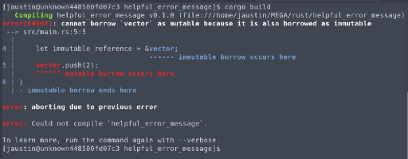

<link rel="stylesheet" type="text/css" href="../style.css">

[<button class="mh-button mh-b3">Go Back</button>](../index.md)

Follow me on

[GitHub](https://github.com/dev117uday) || [LinkedIn](https://www.linkedin.com/in/uday-yadav-4995a818a/)

# Rust: New Systems Programming Language
Author: Uday Yadav



For those of you who don’t know what Rust is, here is a quick and short intro
- Rust was originally designed by Graydon Hoare at Mozilla Research, yes, the company that makes Mozilla web browser.
- Rust is a programming language focused on performance and safety, especially safe concurrency. - Rust provides memory safety without using garbage collection (like Golang).
- It’s a systems programming language, hence it can run as fast as C and sometimes even faster.

### Why Rust
In the world where C/C++ powers everything we know, what brings us to Rust? Well here is an example to consider:

Take a look at this graph:


70% of security issues that Microsoft encounter are due to memory unsafety. Why this happens? Because writing memory-safe code is hard. It’s not that these issues are left neglected at the time of production and testing, but due to the reason, it’s so difficult to write and catch errors. That’s why languages like Python and JavaScript were created, to abstract out these complexities and to empower more developers to create stuff. But they come with performance penalties and run-time overheads. This is a place where Rust comes in.

### Why I love Rust
**Here is a list of things that I love about Rust**

1. **Syntax**: Rust has a very sensible syntax, making it easy and fast to understand and while abstracting on a lot of things. Though, it’s not as easy as python but compared to C, it's much cleaner. It shares a lot of similarities with modern programming languages. 

Example:
- Declaring Variable:
```rust
let variable: i64 = 2147483748;// defining datatype is optional
Declaring functions:
fn logger (x: String) -> String {    // some functionality    some_string 
   // don't have to explicitly write return}
```

2. **Performance**: When it comes to performance, there should be no doubt. Rust is a compiled language; thus, it spits out executable binary. From accessing registers in CPU to multi-threading, Rust can squeeze outperformance from every part of the computer.
3. 
4. **Memory**: A main selling point of Rust is that it guarantees, at compile-time, that your application will be safe from de-referencing null or dangling pointers (a.k.a segmentation fault). Rust also makes it difficult to leak memory, but it is not a guarantee. It works on the principle of ownership, defining who is the owner of the memory and its value, and based on this fundamental principle, Rust can guarantee memory safety. Any errors/warnings will be reported at the time of compilation.
   
5. **Package manager**: Yes, like all modern programming languages like Python and JavaScript, Rust also has a package manager called Cargo. It downloads all the packages you mention in cargo.toml file and compiles them with the program at the time of the final compilation.
Bindings: Rust shares an excellent interface with almost all programming languages, notably WASM for Js, pyO3 for python. Hence, this makes it much easier to integrate Rust in an existing project to significantly boost your performance.

6. **Compiler**: Just mind-blowingly amazing, trust me, or you can search about it yourself on the internet. Its compiler is just like a computer teacher that will point out every single error mistake you make with a concise description, suggestion on how to fix the problem, and error code to read more about it. And that’s not all, it tells you detailed warnings, how to fix them, potential runtime errors and style guides, now tell me which language provides such amazing feedback on your code.

**Here are a few examples of compiler complaining: (source Google images)**

Source Google Images <br>


Source Google Images <br>


Source Google Images <br>


### Things I don’t like about Rust

1. **It’s hard to learn:** As compared to other languages, it’s much difficult to get started with Rust. I’ve found that Rust has forced me to learn many of the things that Iwas slowly learning as ‘good practice’ in C/C++ before I could evencompile my code. I want to stress that Rust isn’t the kind of languageyou can learn in a couple days and just deal with thehard/technical/good-practice stuff later. You will be forced to learn strictsafety immediately and it will probably feel uncomfortable at first.The whole concept memory ownership and borrowing Rust focuses on, with features like Option and Result (kind of like promises in JavaScript) increases the learning curve for beginners.
2. **Compiler:** Rust, being a language that provides a level of abstraction much more common to higher-level languages with little to no runtime performance cost, have to pay for that to some extent at compile time. It’s slow to compile.

3. **Framework and ecosystem** : What comes to your mind when you think about system-level programming language like PASCAL, FORTRAN, C/C+, fast programming languages with old toolchain and software development workflows. Now think of Python, JavaScript, modern languages with great toolchain support. Rust combines the power of both worlds. it’s a fast system-level programming language with a modern toolchain. Cargo, Rust’s package manager is boon for developers to get started working on projects in Rust because now they don’t have to waste time linking libraries and adding environment variables which I believe is a hot mess.


Rust has a lot of amazing frameworks in all fields, from Web to ML to game engines, libraries and framework are bubbling up. Rocket, a web framework similar to flask and ruby, was put in production after 3 days of first public release, it was possible only because if your program compiles without any error or warning and pass all limit test case, then it’s pretty much battle proof and production-ready. The frameworks are evolving fast at a point extreme performance can be achieved with ease.

Industry adoption
- Here is a list of everything happening in Rust world
- Mozilla uses Rust in its Quantum engine.
- Microsoft says Rust is the industry’s best chance at “safe system programming”.
- Microsoft: Why we used programming language Rust over Go for Web Assembly on Kubernetes app
- Google will be considering Rust to replace parts of android. 
- Apple will migrate to Rust from C in the most networking parts.
- AWS sponsors Rust community and you can write AWS Lambda functions using Rust 
- Amazon’s Firecracker is the virtualization technology that powers AWS Lambda and FarGate, and it is written completely in Rust.
- Facebook made the libra in Rust 
- Deno, the replacement of node, uses Rust to power it. 
- Discord switched from Go to Rust 
- Drop Box uses rust for sync.
- Cloudflare using Rust to create a safe and secure ecosystem.

It’s the systems programming language in the future where it will replace C/C++ first in the world of networking and embedded systems, providing high-performance applications.

