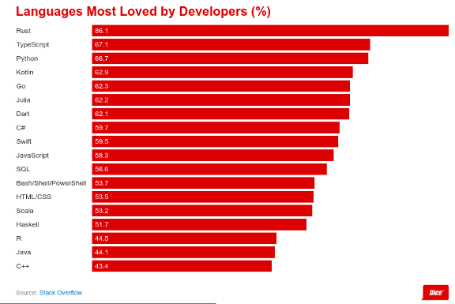
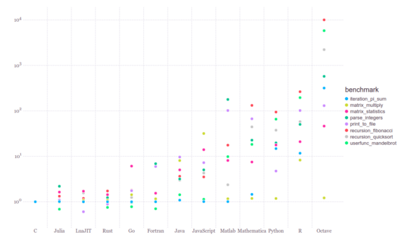

<link rel="stylesheet" type="text/css" href="../style.css">

[<button class="mh-button mh-b3">Go Back</button>](../index.md)

Follow me on

[GitHub](https://github.com/dev117uday) || [LinkedIn](https://www.linkedin.com/in/uday-yadav-4995a818a/)

# My experience of learning 3 programming languages in 3 weeks.

It was amazing!

**Disclaimer: I don’t claim to be an expert in any of them. This was just a thought experiment.**

Here’s how it all began :

In the last week of May, I was working on the front-end part of my personal project, which got me frustrated and bored to some extend. So I decided to take 1–2 days off to refresh myself. I decided to take a deeper look at the world of competitive coding (i do solve some questions, but not very seriously). So wandering on the internet I came to this website called code wars. 

While signing up, they asked to pick a language, but they had more than 50 languages, which got me thinking, why people make so many languages when we already have so many computer languages. Why do they exist?

So I start to search about each one of them but had no success in understanding the difference between them because google cards show the same result for every language, Either it is a multi-paradigm programming language or general-purpose programming language. Thanks, Google.

Searching more on the internet, first came across Rust programming language, saw a few talks/conferences and it fascinated me. Rust is the new C++. Next, I came across Golang, a replacement for Java, and then Julia, one programming language that takes on Python, R, Octave, and Matlab (I will refer to them as PROM )in one shot. So I decided to do a thought experiment, learn 3 programming languages in 3 weeks.

I set my main aims to be :
- Understanding why these languages were create
- What new features and advantages they bring that do not exist elsewhere.
- To understand their basic syntax, design paradigms.
- Performance comparison with existing ones.
- Basic inner workings of there compiler/interpreter.
- Current industry usage.
- Future of these programming languages.

One thing I want to make clear: **I don’t claim to be a professional/expert** with these languages, and 6 months in the future, I am pretty sure I will forget their syntax. 
Nonetheless, this article is about my experience learning going through this thought experiment and learning about different programming languages. 

I also wrote 3 articles on medium about each one that you can check out :

- [Rust is amazing](./intro-rust.md)
- [Julia: A fresh approach to technical computing](./intro-julia.md)
- [Go Golang Go!](./go-golang.md)

### Understanding why these languages were create
These programming languages were created to overcome the long list of features and functionality that can now have become an essential part of software development(more on that later) and other engineering tasks

- The industry has been using PROM, but there was nothing that exists when it comes to combining simplicity and performance of all. 
Julia is fast as C and simple as R. Julia can do everything python, R, octave, Matlab can do. Matlab was designed was for technical computing, but is not open-source, that’s were octave tries to cover the gap, R was designed for statistical computing, python jumps in because its a really good general-purpose programming language and has really good interface, hence using DS and ML libraries are easy. If you take a close look, all of them are trying to achieve the same thing. But now the industry is stuck using all these different things that Julia alone can do.

- Everyone’s favorite C/C++ is cool and amazing but it is a huge headache for companies when it comes to writing it safely. C/C++ is hard, which makes writing memory-safe code in C/C++ even harder.

- [Memory Issues in C++](https://www.chromium.org/Home/chromium-security/memory-safety)

- Because we need the high-performance at all cost, the industry is stuck with them, and though they have served pretty well up till now, problems they create is costing us billions of dollars. Money wasted in the world because of these issues is constantly growing.

- [Microsoft: Rust Is the Industry’s ‘Best Chance’ at Safe Systems Programming](https://thenewstack.io/microsoft-rust-is-the-industrys-best-chance-at-safe-systems-programming/)

- This is where Rust comes in. It promises safety and great concurrency support with “zero cost to performance”

- Java, the language that dominates in the software industry, has now aged and isn’t able to keep in any field. Android has Kotlin, Flutter, React Native to replace it, and more and more apps/services move to electrons and PWA’s, Java is on the decline. But one field where it still holds its crown is the server-side. 

- Though Node.js opposed a great threat, Golang promises to replace java completely. With a better garbage collector, high performance, and great concurrency, it can solve almost all Java problems.

### What new features and advantages they bring that do not exist elsewhere?

For an in-depth overview of each of these programming languages, please refer to the articles linked above. Here I will just be comparing them with existing ones

- Programming languages like C/C++ were created with high performance and low memory consumption in mind, which also means adding extras features and functionality to the language means burdening the compiler with more processing and requiring more memory. This not the case anymore. Rust uses LLVM which gives up little speed and performance (in terms of compiling), but because the language has to implement such restrict measures in terms of memory safety, it would have been a far more difficult job to implement it any other way. But because we have far more powerful computers, that minor delay in the compilation is neglected over the features and functionality we get. Julia also uses LLVM.

- There is one thing to note : compiling code in Rust, Golang and Julia for the first time, or with a new library is quite slow because all the libraries have to re-compiled, but that’s just one time problem.

- Talking more about the compiler, Both Rust (via Cargo, it’s package manager ) and Golang provides hot reload functionality while writing programming. This is an amazing feature that is super famous among app and web developers, the ability to see your work without manual hitting compile button is superb. This is something that is missing from a lot of programming languages and even frameworks.

- In PROM, you are mostly stuck with libraries that are provided to you, because they are usually written in C/C++. Yes, there is a huge collection out there but they don’t provide you with the flexibility to make changes, or even the option to make your own. You can write to them manually but the performance hit it will be big. Everything from tuning parameters, to calculating complex equations, you have to depend on features and functionality that they provide. In Julia, from writing your own function to add 2 numbers to writing custom neural nets for research, you can do anything you want.

- Software engineering isn’t just about writing code to solve problems, finding problems in code is equally important. Over the years, external testing tools had been developed but these problems never get addressed from the language side. Rust catches errors in code before developers even begin testing their software. For instance, Rust can help you produce programs that would check the correctness and validity of code at runtime. It even has in-built testing tools. The same goes for Golang. Having an in-built testing library is a huge plus.

**Time to solve = design time + programming time + testing time + debugging time + run time + time for visualization of results**

### Understand their basic syntax, design paradigms

Well, looking at the few lines of code, it’s easy to tell that these modern programming languages have a more sensible syntax.

Neither writing verbose code (java) nor purely in symbols (C++) is fun, from anyone learning to code to professional developer. Rust, apart from amazing features it provides, balances between both the properties and that’s why its the most loved programming language according to stack overflow 2020 survey. Even Go is not far behind.

### Performance comparison with existing ones

I have an in-depth performance comparison in articles about each.

Here is a quick overview :

### Current Industry usage

To be honest with you, I am just a student who has partial knowledge about industry usage. During this period, I tried to research current industry adoption, nonetheless, the knowledge I have doesn’t represent the industry and it’s better to hear it from actual professionals.

#### Golang
- [Is Go Ready for Enterprise?](https://www.levvel.io/resource-library/is-go-ready-for-enterprise)

- [State of Enterprise GoLang in India](https://medium.com/@sathishvj/state-of-enterprise-golang-in-india-e266c88dfbe)

#### Rust

- [Even Apple Is Interested In Migrating Their C Code To Rust](https://www.phoronix.com/scan.php?page=news_item&px=Apple-From-C-To-Rust)
- [Microsoft: Rust Is the Industry’s ‘Best Chance’ at Safe Systems Programming](https://thenewstack.io/microsoft-rust-is-the-industrys-best-chance-at-safe-systems-programming/) 
- [Programming language Rust's adoption problem: Developers reveal why more aren't using it](https://www.zdnet.com/article/programming-language-rusts-adoption-problem-developers-reveal-why-more-arent-using-it/)

#### Julia

- [Why Amazon, Disney and Uber are courting this two-year-old startup](https://economictimes.indiatimes.com/small-biz/startups/why-amazon-disney-and-uber-are-courting-this-two-year-old-startup-julia-computing-viral-shah/articleshow/60169227.cms?utm_source=contentofinterest&utm_medium=text&utm_campaign=cppst)

- [The Infancy of Julia: An Inside Look at How Traders and Economists Are Using the Julia Programming Language](https://www.waterstechnology.com/trading-tools/2476518/the-infancy-of-julia-an-inside-look-at-how-traders-and-economists-are-using-the-julia-programming-language)

**Future of these programming languages**
Well, if you are wondering why anything of these programming languages hasn’t been in headlines all over the internet is because :

- They are programming languages, not frameworks.
- They are relatively new

I think that’s the major reason why they aren’t famous, but that doesn’t mean industries aren’t betting on them. All these languages have gotten more and more attention from companies as compared to other modern programming languages. But I think it’s safe to say, you so start learning them now, 4–5 years in future, you will definitely have an earlier adoption advantage.

**I hope you like this article !**