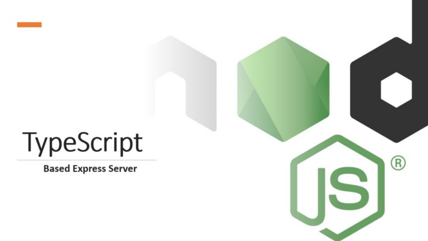

<link rel="stylesheet" type="text/css" href="../style.css">

[<button class="mh-button mh-b3">Go Back</button>](../index.md)

# Getting Started With TypeScript based Express Server



You can simply get started with my boilerplate on GitHub : [dev117uday/boiler-plate-ts-node-server](https://github.com/dev117uday/boiler-plate-ts-node-server)

**The Big Question: Why this article when there are hundreds of similar articles on this topic.**

**Answer:** When I tried to create a typescript server with node, I faced issues that weren't addressed in procedures I followed.


So let's get started
1.  Create a new project folder
- Create a new project folder on your computer and open it in your terminal
- Run the following command to initialize an npm project : `npm init`
2. Installing Dependencies :

- Install the following dependencies that will get you started

```
npm install typescript express @types/express @types/node ts-node ts-node-dev
```

- Add tsc in scripts inpackage.json

```
"scripts": {
...
    "tsc":"tsc",
...
}
```

Then run : `npx tsc --init`

The above npm install command contains packages `ts-node` and `ts-node-dev`. When you write code inside a `.ts` file, in order to run it, you first need to run tsc and then run the .js file it produces. While working with a typescript node server, you have to first convert all `.ts` files to `.js` files and then run the server file. And that's the problem if you using nodemon, it by default does not compile .ts files to .js file, hence every time to make a change, you first have to stop the server, run `tsc` and then run the server file again. Not cool right?

`ts-node` and `ts-node-dev` help solve this problem, with s few others.

You don't have to manually compile ts files, nor make some fancy change to any config files
These packages don't generate `.js` file in your file system, hence no clutter in your repository

This was the big problem I faced while getting started with typescript express server. Moving on

3. Finalizing scripts in package.json
- Your scripts package.json must contain these commands

```
"scripts": {
...
  "tsc": "tsc",
  "postinstall": "tsc",
  "start": "node server.js",
  "dev": "ts-node-dev server.ts"
...
}
```

4. Create server.ts file

```
import express = require('express');

// Create a new express app instance
const app: express.Application = express();

//routes
app.get('/', function (req, res) {
	res.send('Hello World');
});

app.listen(3000, function () {
	console.log('App is listening on port 3000');
});
```

That's It
You can now run your server using `npm run dev`

I hope you like this article :

Follow me on

[GitHub](https://github.com/dev117uday) || [LinkedIn](https://www.linkedin.com/in/uday-yadav-4995a818a/)
