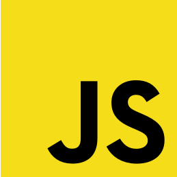

# Hey there

### Hello World 👋 It's me Uday Yadav!

 

 

Hi,I'm Uday Yadav ! I'm a Full stack developer interested in web development,cross platform development and Dev-Ops,and I'm active in competitive programming too. Glad that you visited my profile!

**About me:**

- 🔭 Web Lead at Google Developer Student Clubs ADGITM
- 🔭 Core Team Member at DataQuest : community of 700+ students

<link rel="stylesheet" type="text/css" href="./style.css">

**Find my writings at :**

- [<button >Notes.md</button>](https://dev117uday.gitbook.io/notes-md/)
- [<button >Codeblog.md</button>](https://dev117uday.github.io/codeblog/)
- [<button >Golang.md</button>](https://dev117uday.gitbook.io/golang-md/)
- [<button >DSA.md</button>](https://dev117uday.gitbook.io/ds-and-a/)
- [<button >Project Ideas</button>](https://dev117uday.github.io/project-idea/)
- [<button >Learning GCP</button>](https://dev117uday.github.io/learning-gcp/)

### Tech Stack :

<code></code> &nbsp;
<code></code> &nbsp;
<code></code> &nbsp;
<code></code> &nbsp;
<code></code> &nbsp;
<code></code> &nbsp;
<code></code> &nbsp;
<code></code> &nbsp;
<code></code> &nbsp;

